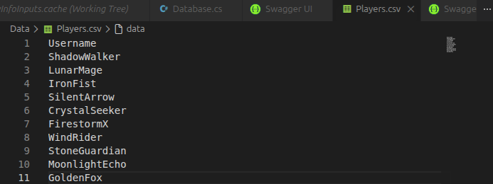
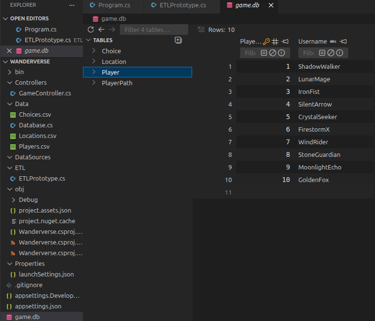
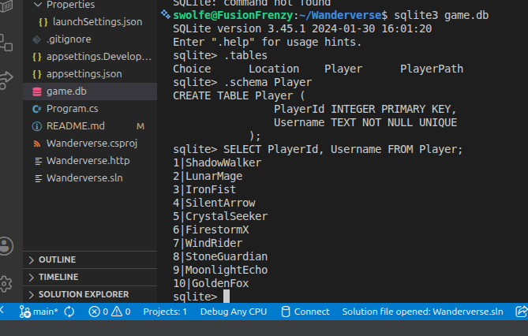

# Wanderverse

Wanderverse is a small game API built using .NET 9 and SQLite. It manages players, locations, choices, and player movement within a game world. This project includes an ETL pipeline to load initial data from CSV files and REST API endpoints to interact with the game.

## Data Sources

The ETL pipeline currently ingests data from three CSV files located in the `Data/` folder:

- **Players.csv**
    Contains a list of unique player usernames 
- **Locations.csv**
    Contains a list of locations, each with an ID, name and description
- **Choices.csv**
    Contains game choices that connect locations 

## Running the ETL Pipeline

The ETL pipeline reads the CSV files and populates the `game.db` SQLite database.

### Steps

1. Ensure your CSV files are updated in `Data/`
2. Run the ETL pipeline via the api project

```bash
dotnet run --project Wanderverse.csproj etl
```

## Transformations Preformed

1. Players
    - Reads usernames from `Players.csv`
    - Adds unqique usernames to the Player table
2. Locations
    - Reads location IDs, names and descriptions.
    - Adds them to the Location table
3. Choices
    - Reads choice ID, from/to location IDs and text
    - Adds them to the choice table, linking locations with valid foreign keys

## Database Schema Mapping

| Table        | Columns                                                    | Description                                  |
| ------------ | ---------------------------------------------------------- | -------------------------------------------- |
| `Player`     | `PlayerId`, `Username`                                     | Stores unique player information.            |
| `Location`   | `LocationId`, `Name`, `Description`                        | Stores all game locations.                   |
| `Choice`     | `ChoiceId`, `FromLocationId`, `ToLocationId`, `ChoiceText` | Connects locations via game choices.         |

## How to run

- `dotnet restore`
- `dotnet run --project Wanderverse.csproj`

## Reflection

### What part of your pipeline is currently working?

- The ETL pipeline successfully reads data from CSV files (`Locations.csv`, `Choices.csv`, `Players.csv`) and populates the SQLite database (`game.db`).
- The API can create new players, record player moves, and fetch a player’s movement history.
- Swagger UI is set up and working for exploring the endpoints.

### What parts are incomplete or simplified?

- There is currently no endpoint for dynamically fetching available choices for a player’s current location (i.e., a “pick location” feature is not implemented yet).
- Player input validation and error handling are minimal; for example, duplicate usernames throw exceptions.
- The ETL currently reloads all data without preserving history or incremental updates.
- Some transformations are basic, mainly just reading CSV rows and inserting them into the database without additional processing.

### What challenges did you encounter?

- Managing database uniqueness constraints (duplicate usernames) caused problems when reloading the CSV data. So when I imported it into `game.db`, the data didn’t match the expected format.
- Setting up the SQLite connection so it works correctly for both the ETL process and the API was tricky, since I’m still learning how to work with databases in C# and .NET.
-Figuring out how to integrate the ETL pipeline into the API project while keeping the workflows separate was challenging. I almost ended up splitting the files entirely.
- Debugging and updating the CSV-to-database mapping to match the database schema.

### What are your next steps before the final submission?

- Create a feature so players can see where they can go next and actually choose a location to move to.
- Make the system better at catching mistakes and handling errors in both the data-loading process (ETL) and the API.
- Update the data-loading process so it only adds new information without overwriting what’s already in the database.
- Add instructions and examples so it’s easier for others to understand and test the API.
- Test everything together to make sure players, locations, choices, and their paths all work correctly.

## Sample Output
- Before (Players.csv)

- After (Players inside `game.db`, player IDs are assigned automatically)

- The raw CSV Players are loaded into the database with a unique PlayerId. 


